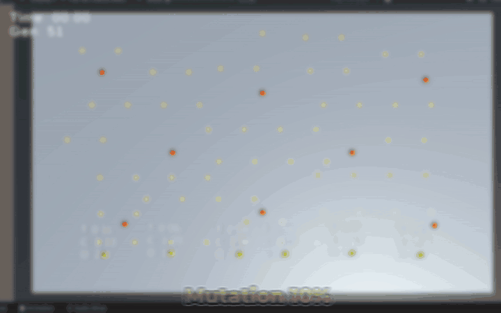
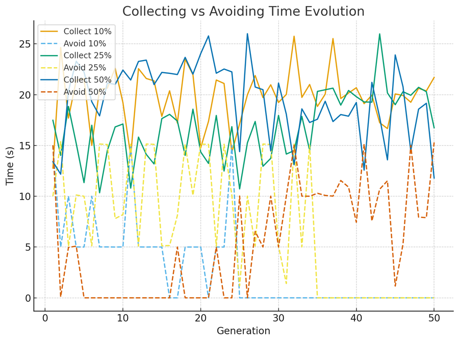
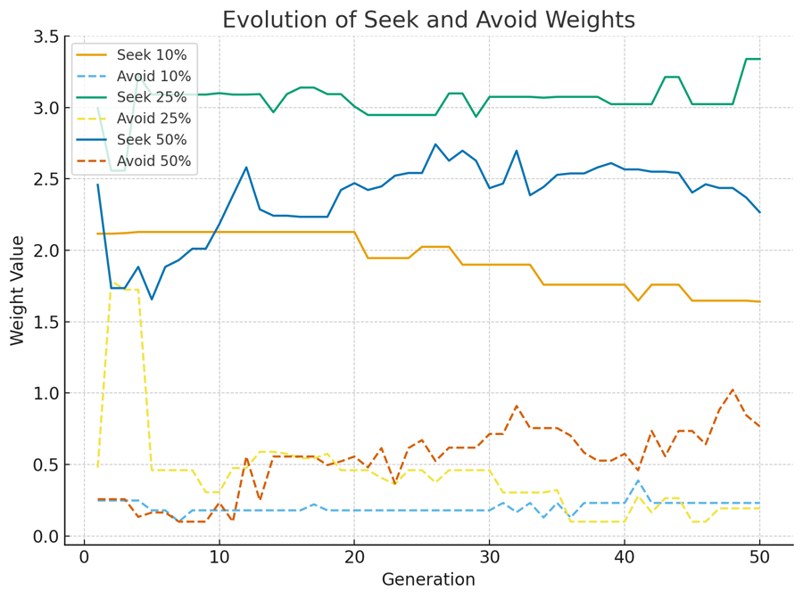

# Utility vs Reflex AI

A Unity research simulation in two phases. First I compared reflex-based and utility-based agents. Then, in about a week, I built a genetic algorithm from scratch, with no GA library, that evolves the utility agent's parameters. Solo project for the Saxion *Advanced Tools* course (Apr–Dec 2025), graded 10 / 10 with full marks for the prototype, the evaluation and the understanding criteria.

 Generation 1 → 50 at 25% mutation, sped up 3×. Each agent shows its collected count and live utility scores.

## Phase 1: reflex vs utility

Agents in a mirrored arena collect yellow items and avoid red threats.

- **Reflex agents** follow fixed rules: move to the nearest collectible, move away from threats that come too close. They are cheap and predictable, but they can't weigh competing goals.
- **Utility agents** score every option:
  - distance normalised and capped
  - a penalty for collectibles that sit near threats
  - a minimum score gap before switching behaviour, so they don't flip between targets every frame

I ran three structured comparison runs, plus expert, aggressive and indecisive utility variants. The utility agents adapted far better. Both models are O(n) per agent per decision; utility only adds a constant factor. Tuning the utility weights by hand was the real cost, and that led to phase 2.

## Phase 2: evolving the utility agent

Each utility agent carries six genes:

| Gene | Controls |
|---|---|
| `seekCollectibleWeight` | Pull towards collectibles |
| `avoidThreatWeight` | Push away from threats |
| `minimumDifferenceThresholdBetweenWeights` | Score gap needed to switch behaviour |
| `maxRelevantDistance` | How far the agent looks |
| `threatProximityPenaltyRadius` | How close a threat must be to devalue a collectible |
| `threatProximityPenaltyWeight` | How much that devalues it |

A `PopulationManager` runs the cycle: spawn the population with the current genes, run a generation for 30 seconds or until the arena is cleared, and rank the agents by collectibles gathered. The top 30% become parents. Uniform crossover picks each gene from one parent, and mutation nudges genes by a small random delta within safe bounds.

**Setup:** a fixed arena with about 60 collectibles and 12 threats, 6 agents, and 50 generations at each of three mutation rates (10%, 25%, 50%). Every agent writes `agent_metrics.csv` each generation, `best_agents.csv` keeps each generation's top performer, and a ScriptableObject holds the best agent found overall.

<table>
<tr>
<td width="50%"></td>
<td width="50%"></td>
</tr>
</table>

## Findings

- **Agents learned to take calculated risks.** Time spent avoiding fell towards zero at 10% and 25% mutation, while collecting time rose. `seekCollectibleWeight` climbed fastest; `avoidThreatWeight` rose more slowly.
- **Behaviour became decisive.** In generation 1 agents hesitated, stalled near walls and oscillated between goals. By generation 50 most moved in efficient loops through collectible clusters and dodged threats smoothly.
- **25% mutation worked best.** 10% was stable but slow, and 50% swung between strong generations and regressions.
- **The simple fitness worked.** Counting collectibles alone was enough to produce emergent, measurable behaviour change.

## Inside the project

- Base, reflex and utility agents, an AI manager that spawns each type at named spawn points, and extra arenas with more collectibles or denser threats
- A debug view: target gizmo lines, floating utility scores, an on-screen timer and distances, a fly camera, pause and game-speed control
- Per-agent metrics: time alive, deaths, time to first collectible, and time collecting versus avoiding

Scripts: [`Assets/UtilityVsReflexBasedAI/Code/Scripts`](UtilityVsReflexBasedAI/Assets/UtilityVsReflexBasedAI/Code/Scripts) · Unity 2022.3

`Unity` `C#` `Utility AI` `Genetic algorithm` `Game AI research`
